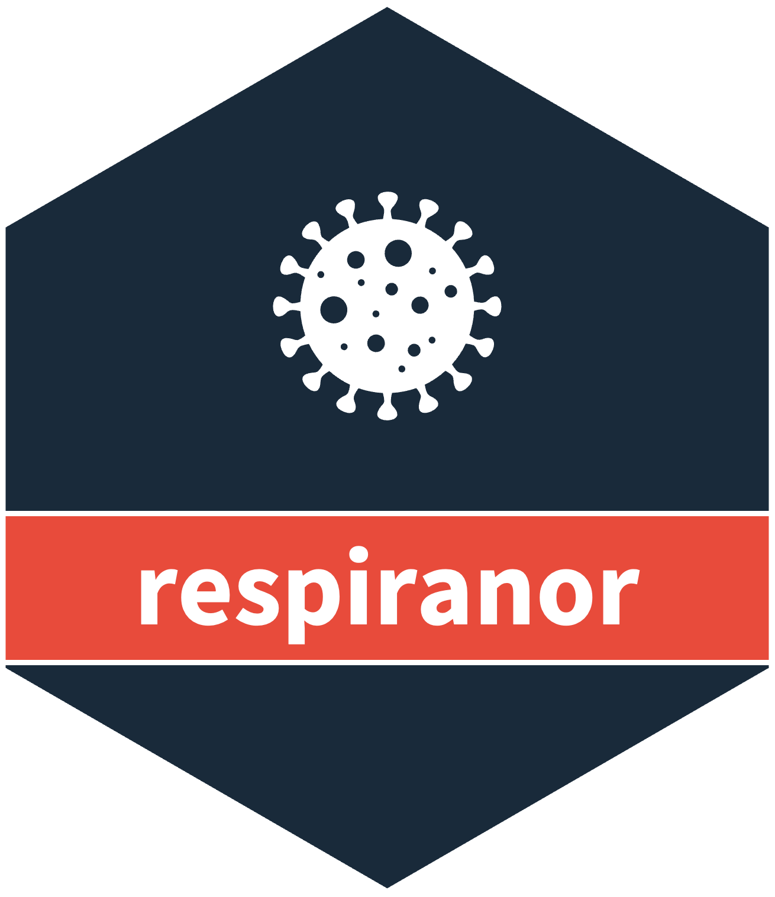

# covidnor <a href="https://www.csids.no/covidnor/"></a>

## Overview 

Starting 2020-04-24 and continuing until 2022-11-14, when they were shut down due to a lack of funding, the Sykdomspulsen team from the Norwegian Institute of Public Health automatically published machine-friendly COVID-19 data updates on weekdays at 13:15. These updates included information on case numbers, ICU/hospital admissions, deaths, testing, and vaccinations. [covidnor](https://www.csids.no/covidnor/) cleans and merges the publically available datasets into analysis-ready datasets.

Read the introduction vignette [here](http://docs.sykdomspulsen.no/covidnor/articles/covidnor.html) or run `help(package="covidnor")`.

## csverse

<a href="https://www.csids.no/packages.html"></a>

The [csverse](https://www.csids.no/packages.html) is a set of R packages developed to help solve problems that frequently occur when performing disease surveillance.

If you want to install the dev versions (or access packages that haven't been released on CRAN), run `usethis::edit_r_profile()` to edit your `.Rprofile`. 

Then write in:

```
options(
  repos = structure(c(
    CSVERSE = "https://www.csids.no/drat/",
    CRAN    = "https://cran.rstudio.com"
  ))
)
```

Save the file and restart R.

You can now install [csverse](https://www.csids.no/packages.html) packages from our [drat repository](https://www.csids.no/drat/).

```
install.packages("covidnor")
```

